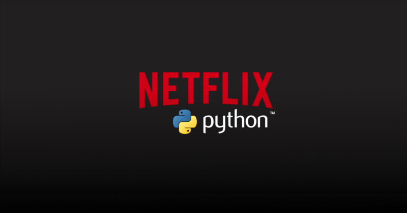

## Netflix Python Project

#### Overview
In this project I have used Netflix Tv Shows and movies dataset to clean the data and used the cleaned data to answer some of the questionsregarding netlix. For data transformation I used various filtering functions and aggregate functions to find the statistics. I also usedthe matplotlib and seaborn library to create some basic chartd to visualize the data.
In this project I have showcased my skills in data cleaning and data transformation which is the most important aspect to have a cleaned data for futher using the data for visualization in tools like Power BI or Tableau.

**PYTHON--CODE** ---> https://github.com/Heysen3101/NetFlixPythonPro/blob/master/main.py

**DATASET-USED** ---> https://drive.google.com/file/d/19ANRLTamKZRroIGwunygdco4HW9OXfQ4/view?usp=sharing
